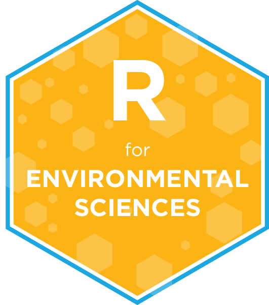

 

# University of Manitoba   R for Environmental Sciences   (ENVR 4000 / GEOG 7010)   Fall 2021

## Past lecture slides and recordings

1. Week 01: :movie_camera: [Recording](https://youtu.be/MQUMcXpIHro) | :bar_chart: [Slides](https://www.dropbox.com/s/fjjdlbz265p5f8r/Wk1_UM_R_for_EnvSci.pptx?dl=0) 
2. Week 02: :movie_camera: [Recording](https://youtu.be/7ggmdjX0xbM) | :bar_chart: [Slides](https://www.dropbox.com/s/uxo1xmhcvl5ipnj/Wk2_UM_R_for_EnvSci.pptx?dl=0)
3. Week 03: :movie_camera: [Recording](https://youtu.be/SYS_Iz1BsmU) | :bar_chart: [Slides](https://www.dropbox.com/s/9g4aperzq998fvk/Wk3_UM_R_for_EnvSci.pptx?dl=0) | :computer: [Code](https://github.com/UM-R-for-EnvSci-Registered-Student-2021/Wk03-Class_materials)
4. Week 04: :movie_camera: [Recording](https://youtu.be/HAWCdwgBzp8) | :bar_chart: [Slides](https://www.dropbox.com/s/t2vdp7keo4p4wm3/Wk4_UM_R_for_EnvSci.pptx?dl=0) | :computer: [Code](https://github.com/UM-R-for-EnvSci-Registered-Student-2021/Wk04-Class_materials)

## Assignments

1. Week 01: [Link to accept the assignment](https://classroom.github.com/a/j3Aac7w5)
2. Week 02: *No assignment*
3. Week 03: [Link to accept the assignment](https://classroom.github.com/a/nOUCvb84)
4. Week 04: [Link to accept the assignment](https://classroom.github.com/a/53XcaJP9)

## TidyTuesday Commentary Assignments

1. Week 01: *No assignment*
2. Week 02: *No assignment*
3. Week 03: *No assignment*
4. Week 04: [Assignment repo](https://github.com/UM-R-for-EnvSci-Registered-Student-2021/wk04-Tidytuesday-commentary)

## Tentative course schedulle

We will try to follow the below schedulle. Some things might take a bit longer and some might take a bit less, but we will cover all important parts listed below (and maybe more!)

Week | Class date | First half of class | Second half of class |
---- | ---------- | ------------------- | -------------------- |
1 | 2020-09-14 | Intro | Git and GitHub |
2 | 2020-09-21 | Tidy data | Rstudio set up and projects |
3 | 2020-09-28 | RStudio set up and projects II | Base R, objects and I/O |
4 | 2020-10-05 | Base R, objects and I/O II | Tidyverse |
5 | 2020-10-12 | R Markdown and {here} | Quick Intro to ggplot |
6 | 2020-10-19 | ggplot basics | ggplot - themes and scales |
7 | 2020-10-26 | ggplot - annotations | ggplot - multiplots |
8 | 2020-11-02 | Working with dates | Merging and joining datasets|
9 | 2020-11-09 | No class - fall break | No class - fall break |
10 | 2020-11-16 | Data exploration and counting | Working with strings |
11 | 2020-11-23 | Working with model outputs | The magic of {purrr} |
12 | 2020-11-30 | Conditionals, loops and more | Geospatial data with R|
13 | 2020-12-07 | Animated and interactive plots | Review |
14 |2020-12-14 | No class - Take-home exam | No class - Take-home exam |

